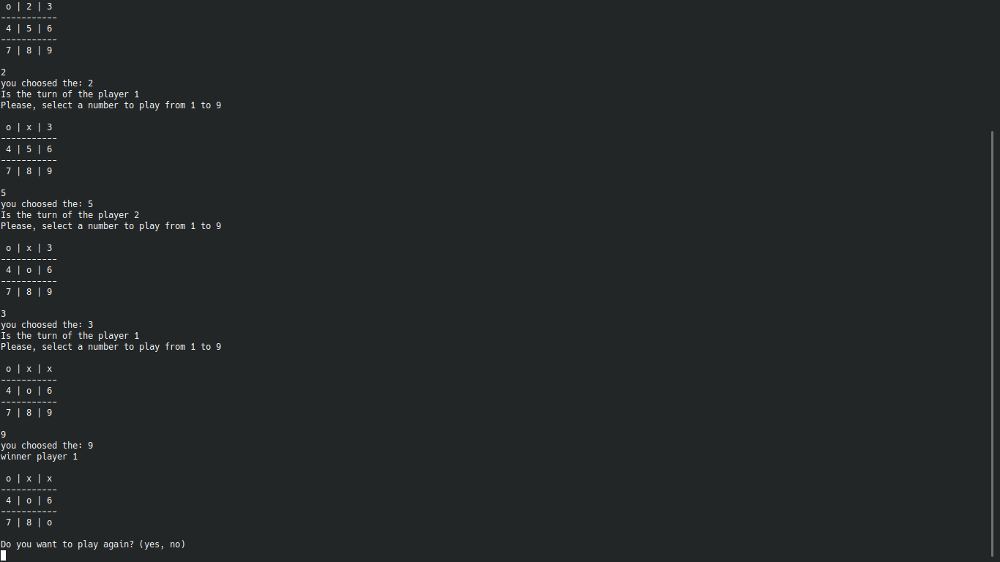

# Tic-Tac-Toe

> This project is a simulation of Tic-Tac-Toe game.

 

## Descriptions of the Game

This is a game for two players, in this game there is board with a 3x3 grid where players can put 'x' or 'o' in each space, and the player who has three symbols aligned horizontally, vertically or diagonally is the winner of the game.

## Instructions

### Start the game 

First of all, you need to run the file with the name main.rb. To run the file you need to open the terminal inside the project and run ```ruby bin/main.rb```.

### Playing the game

In this game each space form the board is representer by a number from 1 to 9, each player chooses the number inside the terminal to play and the program assigns the symbol automatically and start the game, and switches the role between the two players every turn until it finds a winner or a draw (no winner/no loser).

## Built With

- Ruby

## Live Demo

For the live version [Click here](https://repl.it/@LOctavio/Tic-tac-toe)


## Getting Started


### Prerequisites

- install [Ruby](https://www.ruby-lang.org/en/)

### Setup

- Clone the repository ```https://github.com/muhenge/Tic-tac-toe```

## Authors

👤 **Luis Octavio Ramirez Cruz**

- Github: [@LOctavio](https://github.com/LOctavio)
- Twitter: [@Luis Octavio Ram_ram431](https://twitter.com/Octavio_ram431)
- Linkedin: [linkedin](https://www.linkedin.com/in/luis-octavio-ramirez-cruz-714521178/)

👤 **Ngenzi Mugunga Herve**

- Github: [@muhenge](https://github.com/muhenge)
- Twitter: [@NGENZIHerve](https://twitter.com/NGENZIHerve)
- Linkedin: [linkedin](https://www.linkedin.com/in/mugunga-herve-a62a0ab9/ )

## 🤝 Contributing

Contributions and advices are welcomed

Feel free to check the [issues page](https://github.com/muhenge/Tic-tac-toe/issues).

## Show your support

Give a ⭐️ if you like this project!

## Acknowledgments

- Hat tip to anyone whose code was used
- Inspiration
- etc
